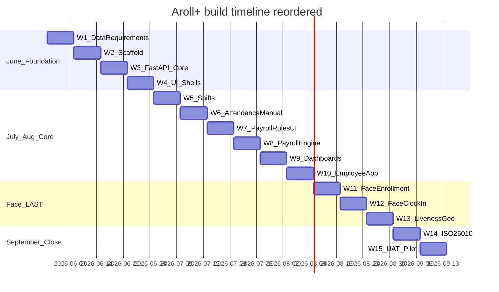
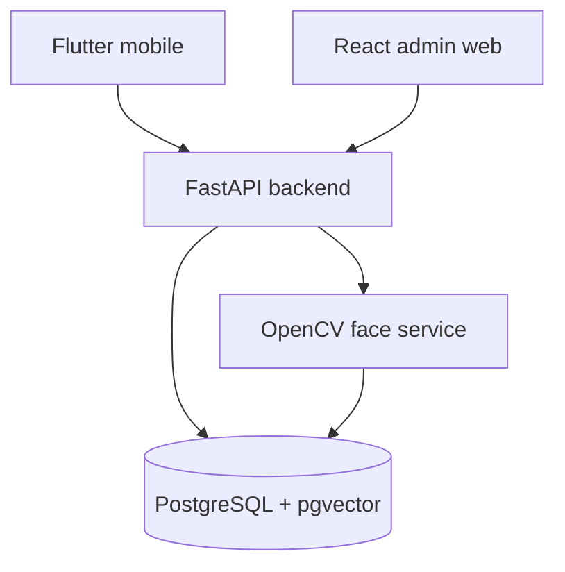
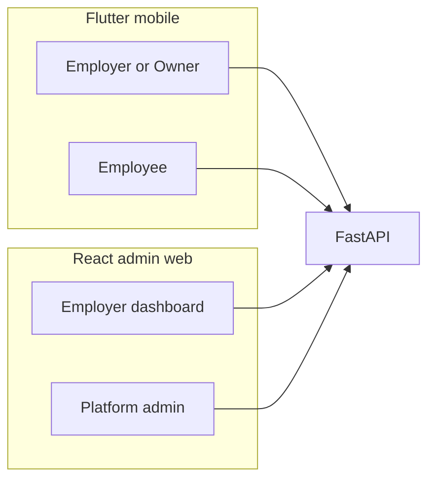
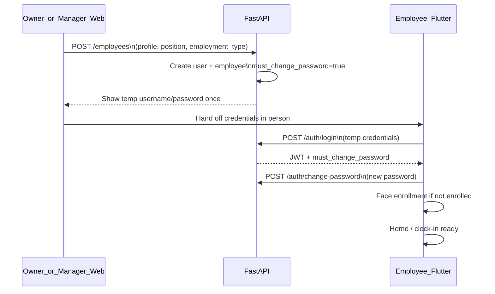

# Aroll+ — Project identity and timeline

## What the project actually is

**Aroll+** (*Face Recognition-Based Attendance and Payroll System*) is a **capstone/thesis** system for **four small food-and-service businesses** in Bicol, Philippines:

| Business            | Type                     |
| ------------------- | ------------------------ |
| Mr. Bean Cafe       | Cafe                     |
| Ugom Cafe           | Cafe                     |
| Pande Doc           | Service                  |
| Benzon Burger House | Quick-service restaurant |

**Core problem:** Manual logbooks/spreadsheets for attendance and payroll → errors, delays, buddy punching, no real-time view for owners/managers.

**Core solution:** One platform where employees **clock in/out** with **face recognition + liveness + geolocation**, managers/owners monitor time, and **payroll is computed automatically** from recorded hours (shifts, OT, deductions).

**Roles:**

| Role           | Responsibility                                                        |
| -------------- | --------------------------------------------------------------------- |
| Platform admin | Approve/reject business registrations                                 |
| Business owner | Full workforce, attendance, payroll, shifts after approval            |
| Manager        | Employees, shifts, attendance monitoring, payroll processing          |
| Employee       | Clock in/out; **read-only** schedules, attendance, payslips, feedback |

**Out of scope:** Inventory, POS, customer purchases. **Auth decision (confirmed):** face only — not QR/pincode (Chapter 1 Significance text still needs a manuscript fix before defense).

**Study objectives:**

1. Data requirements (entities, payroll rules, geofence, roles)
2. Design mobile app centralizing attendance + payroll via facial recognition
3. Evaluate on **ISO/IEC 25010** — Functional Suitability and Reliability

**Planned stack:**

| Layer     | Tech                                                                                       |
| --------- | ------------------------------------------------------------------------------------------ |
| Mobile    | Flutter — **shadcn_ui**, **BLoC**, **go_router**, **GetIt**, dio (see package table below) |
| Admin web | **React** + **shadcn/ui** (Vite + TS + Tailwind + TanStack Query)                          |
| API       | FastAPI                                                                                    |
| Face      | OpenCV (+ embeddings) — last implementation block                                          |
| DB        | PostgreSQL + pgvector                                                                      |

### UI / frontend framework standards (confirmed)

Both clients use the **shadcn design system** — React via official shadcn/ui; Flutter via `**shadcn_ui`** ([pub.dev](https://pub.dev/packages/shadcn_ui), [docs](https://mariuti.com/flutter-shadcn-ui/)).

| App              | UI + architecture                        | Notes                                                                                                                        |
| ---------------- | ---------------------------------------- | ---------------------------------------------------------------------------------------------------------------------------- |
| `**admin-web/**` | shadcn/ui + Vite + React Router          | Owner + platform admin (web-first)                                                                                           |
| `**mobile/**`    | **shadcn_ui** + BLoC + go_router + GetIt | Employee-first; use `ShadApp.custom` wrapping `MaterialApp` + `ShadAppBuilder` so existing screens can migrate incrementally |

Follow [clean_code_bloc.md](clean_code_bloc.md) for Flutter feature folders and BLoC patterns.

---

#### React `admin-web/` — packages (W4 scaffold)

**Core (install with Vite React TS template):**

| Package                                          | Purpose                              |
| ------------------------------------------------ | ------------------------------------ |
| `react`, `react-dom`                             | UI                                   |
| `react-router-dom`                               | Routes (login, admin, owner layouts) |
| `tailwindcss`, `postcss`, `autoprefixer`         | Required for shadcn                  |
| `typescript`, `@types/react`, `@types/react-dom` | Types                                |

**shadcn/ui** (via `npx shadcn@latest init` — pulls peer deps):

| Package                                              | Purpose                                                |
| ---------------------------------------------------- | ------------------------------------------------------ |
| `class-variance-authority`, `clsx`, `tailwind-merge` | shadcn utilities                                       |
| `lucide-react`                                       | Icons                                                  |
| `@radix-ui/*`                                        | Per installed components (Button, Dialog, Table, etc.) |

**App-specific (add explicitly):**

| Package                                  | Purpose                                 |
| ---------------------------------------- | --------------------------------------- |
| `@tanstack/react-query`                  | FastAPI data fetching, cache, mutations |
| `axios`                                  | HTTP client + interceptors (JWT)        |
| `zod`                                    | Request/response + form validation      |
| `react-hook-form`, `@hookform/resolvers` | Forms (shadcn Form pattern)             |
| `date-fns`                               | Pay periods, attendance dates           |
| `sonner`                                 | Toasts (common shadcn pairing)          |
| `jwt-decode`                             | Read role / `business_id` from JWT      |

**Dev:** `eslint`, `@vitejs/plugin-react`, `prettier` (optional).

**Initial shadcn components to add:** `button`, `input`, `label`, `card`, `table`, `dialog`, `form`, `select`, `badge`, `sidebar`, `sheet`, `tabs`, `dropdown-menu`, `sonner`.

---

#### Flutter `mobile/` — packages (W4 scaffold)

**UI + navigation + state (required):**

| Package        | Purpose                                                         |
| -------------- | --------------------------------------------------------------- |
| `shadcn_ui`    | shadcn-style widgets (Button, Input, Card, Table, Dialog, etc.) |
| `flutter_bloc` | BLoC (already)                                                  |
| `go_router`    | Declarative routes, redirects (`must_change_password`)          |
| `get_it`       | DI (already)                                                    |
| `equatable`    | Events/states (already)                                         |

**API + data:**

| Package                                | Purpose                              |
| -------------------------------------- | ------------------------------------ |
| `dio`                                  | REST client to FastAPI, interceptors |
| `flutter_secure_storage`               | Store JWT securely                   |
| `json_annotation`, `json_serializable` | DTOs (`build_runner` dev)            |

**Utilities:**

| Package          | Purpose                        |
| ---------------- | ------------------------------ |
| `intl`           | Dates/currency (already)       |
| `flutter_dotenv` | `API_BASE_URL` per environment |

**Deferred until face-recognition block (W11–W13):**

| Package                    | Purpose                     |
| -------------------------- | --------------------------- |
| `geolocator`               | Geofence validation         |
| `permission_handler`       | Location/camera permissions |
| `camera` or `image_picker` | Face capture                |

**Dev:** `build_runner`, `flutter_lints` (already).

**Flutter app shell change:** Replace bare `MaterialApp` in [mobile/lib/app.dart](mobile/lib/app.dart) with `**ShadApp.custom`** + `MaterialApp.router` + `go_router` + `ShadTheme` aligned with web tokens where possible.

---

**W2–W4 scaffold targets:**

- `admin-web/` — Vite + deps above + shadcn init + sidebar layout + TanStack Query provider
- `mobile/` — `pubspec` deps above + `shadcn_ui` + `go_router` + `ShadApp.custom` + auth/change-password routes

**Documentation (source of truth for Ch. 3):**

- [docs/SOLUTION.md](docs/SOLUTION.md) — architecture, RBAC, core sequences
- [docs/DATABASE-ERD.md](docs/DATABASE-ERD.md) — ERD, tables, enums
- [docs/SYSTEM-WORKFLOWS.md](docs/SYSTEM-WORKFLOWS.md) — 13 workflow diagrams
- [docs/diagrams/](docs/diagrams/) — 24 standalone PlantUML files

---

## Timeline (checked first)

**Duration:** ~~15 weeks — **1 Jun – ~14 Sep 2026~~**  
~~**Today:** 25 May 2026 → **~~1 week before W1**

Full schedule lives in [aroll+_thesis_understanding_0f94b20e.plan.md](aroll+_thesis_understanding_0f94b20e.plan.md).

**Build order change (confirmed):** Face recognition is **last** — build auth, owner web, shifts, **interim attendance**, payroll, and dashboards first; add OpenCV + pgvector matching + liveness + geofence clock-in in **August W11–W13** before September testing.

### Monthly milestones (revised)

| Month                   | Milestone                                                                                       |
| ----------------------- | ----------------------------------------------------------------------------------------------- |
| **June**                | Business registration → admin approval → owner adds employees (temp password flow); **no face** |
| **July**                | Shifts, **manual/interim attendance**, payroll rules UI, payroll engine, owner dashboards       |
| **August (early–mid)**  | Employee Flutter (login, change password, view schedule/payslip); payroll loop testable         |
| **August (late)**       | **Face recognition last** — enrollment, verify, liveness, geofence clock-in/out                 |
| **September (~14 Sep)** | ISO 25010 + UAT with face enabled; freeze                                                       |

### Week-by-week (next 4 weeks — immediate horizon)

| Week   | Dates     | Focus                          | Deliverables                                                                                                      |
| ------ | --------- | ------------------------------ | ----------------------------------------------------------------------------------------------------------------- |
| **W1** | Jun 1–7   | Objective 1: data requirements | ERD alignment, user stories per role, **payroll rules doc** (rates, OT, deductions), geofence radius per business |
| **W2** | Jun 8–14  | Scaffold                       | Monorepo layout; PostgreSQL schema + migrations; pgvector extension in DB (face tables idle until last block)     |
| **W3** | Jun 15–21 | FastAPI core                   | JWT, RBAC, business onboarding API, employee CRUD                                                                 |
| **W4** | Jun 22–28 | UI shells                      | `admin-web`: Vite + shadcn + admin approval list; `mobile`: go_router + BLoC login/change-password                |

**Critical path:** Data requirements → DB + FastAPI → UI shells → shifts → interim attendance → payroll → dashboards → **face (last)** → ISO 25010 + UAT.

**Interim attendance (until face):** Owner/manager enters attendance on web. Employee Flutter: login, change password, view-only screens — no face scan yet.

**Risk buffer:** If face slips in late August (W11–W13), trim polish/notifications; keep September UAT face-based.

---

## Where the repo stands vs. timeline

| Item                                                                                                                  | Status                                                                               |
| --------------------------------------------------------------------------------------------------------------------- | ------------------------------------------------------------------------------------ |
| Chapter 1 (problem & scope)                                                                                           | Done                                                                                 |
| System design docs ([SOLUTION](docs/SOLUTION.md), [ERD](docs/DATABASE-ERD.md), [workflows](docs/SYSTEM-WORKFLOWS.md)) | Done                                                                                 |
| **W1 data requirements** (payroll rules, finalized geofence, user stories)                                            | **Pending** — due Jun 1–7                                                            |
| `backend/`, `face-service/`, `admin-web/`, `docker-compose.yml`                                                       | Not scaffolded (planned W2–W4)                                                       |
| `[mobile/](mobile/)`                                                                                                  | **Sample** — BLoC + GetIt; W4 adds **shadcn_ui**, **go_router**, dio, secure storage |
| `admin-web/`                                                                                                          | **Not created** — W4: Vite + React + shadcn/ui + TanStack Query + axios              |

The thesis plan file still says “application code not scaffolded yet — start June W2”; that is **mostly accurate** except the Flutter **pattern sample** in `mobile/`, which is ahead of W4 in structure only (not integrated with backend).

---

## Recommended next actions (when you exit plan mode)

1. **W1 (now → Jun 7):** Lock payroll formulas, pay period cadence, OT multipliers, government deductions, and per-business geofence — referenced as deferred in [docs/SOLUTION.md](docs/SOLUTION.md) Section 6 / payroll notes.
2. **Align ERD with W1 decisions** in [docs/DATABASE-ERD.md](docs/DATABASE-ERD.md) before W2 migrations.
3. **Jun 8+:** Scaffold `backend/`, PostgreSQL + pgvector, then wire `mobile/` mock repos to real FastAPI per [mobile/README.md](mobile/README.md) “Next steps”.
4. **Parallel:** Fix Chapter 1 Significance (remove QR/pincode mention) before defense.

---

## Architecture (high level)

Face flow (**deferred to last block**): enrollment → pgvector → clock-in with liveness + geofence → attendance → payroll. Until then, attendance is captured via **owner/manager web** (interim).

---

## UI prototype reference (flexible — not locked)

**Source:** `Copy of Prototype Design.pdf` (91 pages) — user noted **design can change**; treat as UX direction, validate against [docs/SOLUTION.md](docs/SOLUTION.md) and timeline MVP.

**Recommended repo path when building:** `docs/design/Copy of Prototype Design.pdf` (+ PNG exports per section if needed for Figma-free review).

### Three surfaces (matches stack)

| Surface                       | PDF pages | Primary nav                                                                                    |
| ----------------------------- | --------- | ---------------------------------------------------------------------------------------------- |
| **Employer / owner (mobile)** | 1–37      | Bottom: Home, Attendance, Profile                                                              |
| **Employee (mobile)**         | 38–53     | Home hub → Scan, Schedule, Shift History, Payslip                                              |
| **Employer (web)**            | 54–81     | Sidebar: Dashboard, Employees, Schedule, Attendance, Payroll, Productivity, Location, Settings |
| **Platform admin (web)**      | 82–91     | Sidebar: Dashboard, Approved Business, Registration Request, Activity Logs                     |

**Note:** Prototype shows **owner** doing scheduling, payroll, and attendance — no separate **manager** UI. Thesis RBAC still has manager; decide in W1 whether manager shares owner web or is a later slice.

### Confirmed build decisions (from you)

| Decision             | Choice                  | Implication                                                                                                                                                                                                                                                                        |
| -------------------- | ----------------------- | ---------------------------------------------------------------------------------------------------------------------------------------------------------------------------------------------------------------------------------------------------------------------------------- |
| **Owner surfaces**   | **Web-first**           | React `admin-web` = owner dashboards (employees, schedule grid, payroll, location, attendance tables). Flutter mobile **employee-first** (face clock, schedule, payslip). Owner mobile screens in PDF are **lower priority** — keep login/approval status only if needed on phone. |
| **MVP scope**        | **Core flows only**     | Ship onboarding, shifts, payroll, payslip; **defer extras** (productivity scores, etc.).                                                                                                                                                                                           |
| **Face recognition** | **Last implementation** | After shifts/payroll/dashboards (~Aug W11–W13). Interim: owner web attendance. Face required before Sep UAT.                                                                                                                                                                       |

### Key user flows (from prototype)

**A. Business owner onboarding (mobile + web)**

1. Login / Sign In
2. **4-step registration:** Personal info → Business info + document upload (Permit, Owner ID, DTI/SEC, BIR) → Account credentials → **Pending verification** (16–48h estimate)
3. **Approved:** Business ID issued (e.g. `MB-052019`) — for reference / support only (not used for employee self-signup)
4. **Setup wizard (post-approval):**
  - Employee scheduling (Morning/Afternoon/Evening shifts, assign counts)
  - Positions and salary rates (e.g. Cashier ₱500/day; salary type Weekly / 15th Day / Monthly)
  - Payroll schedule + **salary rules:** late deduction (₱/minute), overtime (₱/minute), optional custom rules

**B. Employee onboarding — REVISED (replaces prototype self-registration)**

**Old (prototype):** Employee self-registers with Business ID + creates own password.  
**New (confirmed):** Owner/manager creates the employee; employee only activates account on mobile.

| Step | Actor               | Action                                                                                                                                                                                             |
| ---- | ------------------- | -------------------------------------------------------------------------------------------------------------------------------------------------------------------------------------------------- |
| 1    | Owner/manager (web) | **Add employee** — name, contact, address, job position, employment type, salary/position link; email/username for login                                                                           |
| 2    | System              | Create `user` + `employee` under owner’s `business_id`; set `**must_change_password = true`**; **auto-generate one-time temp password** — show **once** to owner after save (not stored plaintext) |
| 3    | Owner               | Give employee username + temp password (in person / secure channel — email optional later)                                                                                                         |
| 4    | Employee (Flutter)  | **Login** with temp credentials only — no public signup screen                                                                                                                                     |
| 5    | Employee (Flutter)  | **Forced change password** before any other screen                                                                                                                                                 |
| 6    | Employee (Flutter)  | Normal app use (schedule, payslip views). **Face enrollment deferred** to final face-recognition block — not on first-login path for now                                                           |

**Removed from MVP:** Employee 4-step registration, “Enter Business ID” at signup, employee-chosen initial password.

**Aligns with** [docs/SYSTEM-WORKFLOWS.md](docs/SYSTEM-WORKFLOWS.md) §4 (“Receive account from manager”) — extend that diagram with **change password** gate when docs are updated.

**C. Employee daily use**

- **Home:** greeting, My Schedule, **Scan for Attendance**, current salary, performance chips (On Time / Late / Under Time / OT / Absent)
- **Face clock:** guide frame → Verifying → success or fail (align face / **Outside work area** + address) → **Tap to Scan Face to Clock Out**
- **Shift history**, **payslip** (period picker, earnings/deductions/net), **My Schedule** (calendar + co-workers on shift)

**D. Owner operations (mobile home + web dashboard)**

- **Dashboard:** performance overview, today’s attendance %, productivity insights, shortcuts (Manage Employees, Setup Location, Employee Payroll)
- **Employees:** searchable list → profile (employment + personal) → Shift History / Payroll Summary
- **Schedule:** calendar, new shift (start/end), assign employees per shift band (Opening/Mid/Closing), **weekly grid** + customize colors/times
- **Attendance:** day picker, on-time/late/absent counts, per-employee status
- **Payroll:** per-employee breakdown, payroll overview table, payslip PDF download
- **Location:** address + **geofence slider 20m–200m** (example 75m)
- **Settings:** account, business documents, re-run business setups

**E. Platform admin (web)**

- Login (email/password)
- **Dashboard:** totals (businesses, employees), pending registrations, monthly chart, cross-business attendance summary, recent approvals
- **Registration requests:** list → **Review** (business + owner + documents) → **Approve & Generate Business ID** or Reject
- **Approved businesses** list, **activity logs**, admin profile/settings

### Verified: business owner can configure payroll rules

| Source                                                   | Owner configures payroll rules?   | What they can set                                                                                                                                                                |
| -------------------------------------------------------- | --------------------------------- | -------------------------------------------------------------------------------------------------------------------------------------------------------------------------------- |
| **UI prototype**                                         | **Yes**                           | Setup wizard + Settings → Business Setups: pay period (Weekly / 15th Day / Monthly), late deduction (₱/min), overtime (₱/min), optional custom rules; positions with daily rates |
| **[docs/SOLUTION.md](docs/SOLUTION.md)**                 | **Implied, not explicit in RBAC** | Owner may “run/process payroll”; rules are “business-specific” and **TBD W1**; tables `payroll_rule`, `overtime_rule`, `deduction_type` listed as TBD                            |
| **[docs/DATABASE-ERD.md](docs/DATABASE-ERD.md)**         | **Yes (data model)**              | `payroll_rule`, `overtime_rule`, `deduction_type` all scoped by `business_id` — per-tenant rules set by that business                                                            |
| **[docs/SYSTEM-WORKFLOWS.md](docs/SYSTEM-WORKFLOWS.md)** | **Uses rules, not setup UI**      | Payroll activity: “Apply rules (TBD W1)”; no dedicated “owner configures rules” diagram yet                                                                                      |

**Conclusion:** **Yes** — business owners (and managers per RBAC) are intended to define **their business’s** payroll rules, not platform admin. Prototype is clearest; thesis docs should add an RBAC row **“Configure payroll rules”** → Owner: Yes, Manager: Yes (or owner-only if you prefer). W1 must lock which rule fields are MVP (late/OT toggles + pay period + position rates vs custom rules).

**Web-first note:** Rule setup belongs on **owner web** (Setup Account / Business Setups screens in PDF), not employee Flutter.

### Payroll / attendance rules implied by UI (W1 inputs)

| Rule               | Prototype example                                  | Lock in W1?                |
| ------------------ | -------------------------------------------------- | -------------------------- |
| Salary basis       | Daily rate per position (₱500–800/day)             | Yes                        |
| Pay period         | Weekly, 15th day, Monthly + next payday picker     | Yes                        |
| Late deduction     | Toggle; ₱1.00/minute late                          | Yes                        |
| Overtime           | Toggle; ₱/minute OT                                | Yes                        |
| Custom rules       | “Add New Rule” (name, type, amount, frequency)     | MVP or Phase 2             |
| Attendance remarks | On Time, Late, Under Time, Over Time, Absent       | Yes — maps to flags in ERD |
| Geofence           | 20–200 m radius per business address               | Yes — default e.g. 75 m    |
| Payslip            | Basic + OT − late/absent/other → net; download PDF | August (W10)               |

### Prototype vs thesis docs — align / triage

| In prototype                              | In SOLUTION / timeline  | Recommendation                                                          |
| ----------------------------------------- | ----------------------- | ----------------------------------------------------------------------- |
| Face enroll + scan + geo                  | Original July plan      | **Last implementation** — Aug W11–W13; required before Sep UAT          |
| Business ID for employee self-signup      | Prototype only          | **Removed** — owner creates employee; Business ID optional display only |
| Owner-created employee + temp password    | New flow                | **Core MVP** (W3 API + W4 web form + Flutter login/change-password)     |
| Document upload (4 types)                 | Business onboarding     | **Core MVP**                                                            |
| Owner setup wizard                        | Post-approval config    | **June–August** (wizard can be simplified v1)                           |
| Web + mobile for owner                    | React + Flutter planned | Web for heavy tables; mobile for attendance monitoring                  |
| Productivity score, Employee of the Month | Not explicit in Ch.1    | **Defer** or lightweight Aug polish                                     |
| Advance Pay Request                       | Not in scope            | **Out of scope** unless thesis adds it                                  |
| Smart Shift Assignment                    | Not in workflows        | **Defer** — manual assign first                                         |
| Schedule table color customization        | Nice UX                 | **Defer** — functional grid first                                       |
| Admin “global” attendance stats           | Ambitious aggregate     | **Simplify** — pending approvals + per-business counts first            |
| Magic-link login (web p.62)               | JWT in plan             | **Clarify** — email/password MVP unless required                        |

### Map prototype → timeline weeks

| Timeline           | Prototype screens to implement                                                                               |                                                                                                              |
| ------------------ | ------------------------------------------------------------------------------------------------------------ | ------------------------------------------------------------------------------------------------------------ |
| **W1**             | Extract rules table above; user stories per flow A–E                                                         |                                                                                                              |
| **W4**             |                                                                                                              | React: add-employee form + show generated temp password; Flutter: login + forced change-password (no signup) |
| **June post-W4**   | Pending/approved, Business ID, **web** setup wizard (shifts, positions, payroll rules)                       |                                                                                                              |
| **W5–W6**          | **Web:** shifts + schedule grid; interim attendance entry/list                                               |                                                                                                              |
| **W7–W9**          | **Web:** payroll rules, payroll run, dashboards; Flutter employee login/change-password/views                |                                                                                                              |
| **W10**            | Polish, notifications (minimal), payroll loop smoke test with manual attendance                              |                                                                                                              |
| **W11–W13 (LAST)** | **Face:** OpenCV service, enrollment, clock-in/out, liveness, geofence; replace interim attendance on mobile |                                                                                                              |
| **Sep**            | ISO 25010 + UAT — must include face clock-in                                                                 |                                                                                                              |

### Doc / schema changes when implementing (employee onboarding)

| Artifact                     | Change                                                                                |
| ---------------------------- | ------------------------------------------------------------------------------------- |
| `user` table                 | Add `must_change_password boolean DEFAULT false`                                      |
| `POST /employees`            | Owner/manager only; creates user+employee; returns one-time temp password in response |
| `POST /auth/login`           | If `must_change_password`, return flag; client blocks navigation                      |
| `POST /auth/change-password` | Requires current (temp) password; clears flag                                         |
| UC3 / RBAC                   | “Manage employees” includes **provision account** (not self-registration)             |
| Remove                       | Public `POST /auth/register` for employees (if any)                                   |

### Current `mobile/` sample vs prototype

Existing Flutter sample only covers **generic login** + **attendance history list** — not the prototype’s owner bottom nav, face scan, setup wizard, or employee home. W4+ should introduce **role-based routing** (owner vs employee) and replace mocks per screen priority above.