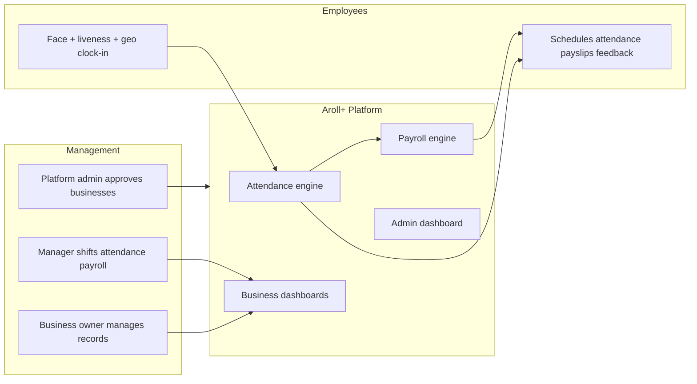
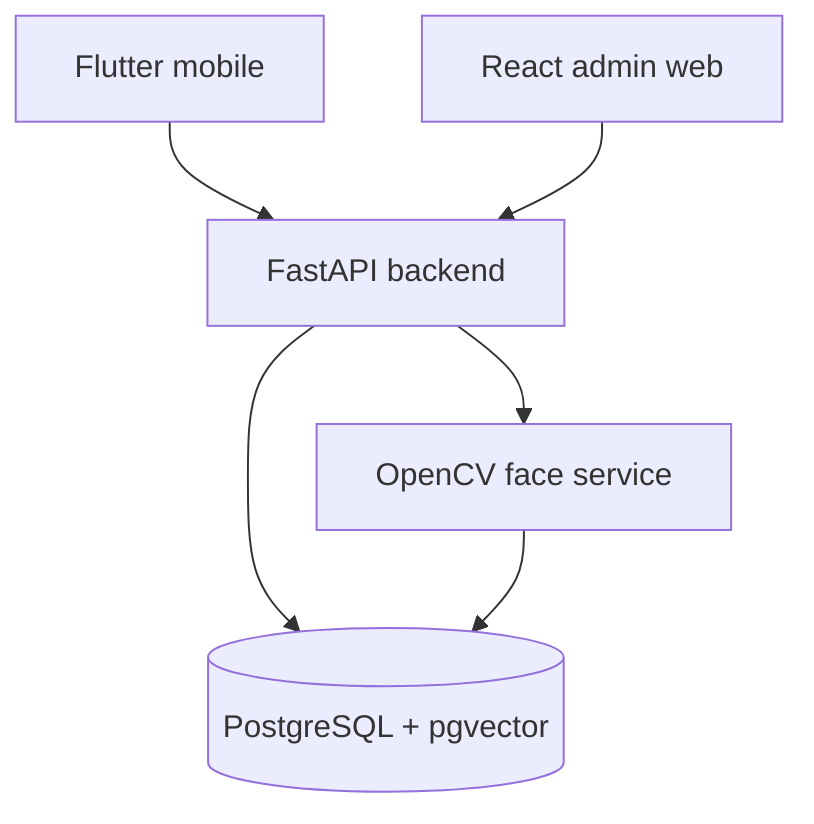
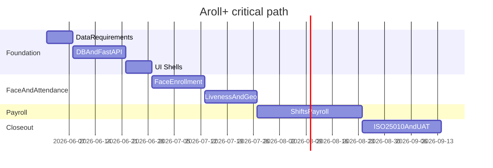

# Aroll+ Thesis Project — Chapter 1 Understanding

## Project identity

| Item | Detail |
|------|--------|
| **Name** | Aroll+: Face Recognition-Based Attendance and Payroll System |
| **Type** | Online / mobile software for SMEs |
| **Target clients** | Mr. Bean Cafe, Ugom Cafe, Pande Doc, Benzon Burger House |
| **Institutional alignment** | UN SDG 8 (decent work); Bicol University Thematic Area 2 (industry & emerging tech) |

## Problem being solved

Local businesses today:

- Track attendance **manually** (logbooks, spreadsheets, messaging apps, or slow fingerprint biometrics)
- Compute payroll **manually**, causing delays, errors, and weak employer–employee transparency
- Lack fixed shift/overtime policies and have **no integrated digital** attendance + payroll platform
- Already use smartphones for work communication but not for official timekeeping

**Pain points:** time-consuming validation (who was late, weekly summaries), wage miscalculations, proxy attendance (“buddy punching”), and no real-time consolidated view for owners/managers.

## Proposed solution (core value)

A **single mobile application** that:

1. **Clocks attendance** via **facial recognition** (contactless), with **liveness detection** and **geolocation** to verify identity and on-site presence
2. **Monitors time in real time** on dashboards
3. **Automatically computes payroll** from captured work hours (deductions, overtime, shifts)



## Stakeholders and permissions

| Role | Capabilities |
|------|----------------|
| **Platform administrator** | Reviews/approves/rejects business registration requests |
| **Business owner** | Adds business after approval; full CRUD on employees, attendance, payroll, shifts, performance reports |
| **Manager** | Adds employees, creates/assigns shifts, monitors attendance, processes payroll via dashboards |
| **Employee** | Clock attendance; **view only** schedules, attendance, digital payslips, performance feedback — **cannot edit** system records |

## Functional scope (in)

- Business onboarding workflow (request → admin approval → owner setup)
- Employee master data, shift creation/assignment
- Attendance capture (face + liveness + geolocation)
- Real-time monitoring and reporting
- Automated payroll from monitored time
- Payslips and performance feedback for employees
- Email notifications of records (mentioned under significance for owners/employees)
- Quality evaluation: **ISO/IEC 25010** — **Functional Suitability** and **Reliability**

## Explicit limitations (out of scope)

- **Not** inventory or POS / customer purchase tracking
- Depends on: accurate face recognition, **internet connectivity**, timely data entry — failures can block attendance marking or correct payroll
- Bounded to the four named businesses for the study design context

## Study objectives (what the thesis must deliver)

1. **Determine data requirements** for system development
2. **Design a mobile application** centralizing attendance + payroll using facial recognition
3. **Evaluate** the system against ISO 25010 (functional suitability + reliability)

## Document inconsistencies to resolve in later chapters

Chapter 1 has **conflicting authentication descriptions**:

- **Scope / introduction:** facial recognition + liveness + geolocation (primary narrative)
- **Significance of the Study (Employees):** “scanning of QR while having pincode authentication”

**Decision (confirmed):** Face recognition is the primary auth method. Update Significance chapter text to remove QR/pincode before defense.

## Tech stack

| Layer | Technology | Role |
|-------|------------|------|
| Mobile | **Flutter** | Employee clock-in, schedules, payslips; manager/owner mobile views |
| Web admin | **ReactJS** | Platform admin (business approval), business dashboards, reports |
| API | **FastAPI** | REST API, auth, payroll logic, face-service orchestration |
| Face pipeline | **OpenCV** | Detect/align faces; generate embeddings (e.g. via `face_recognition` / ONNX model behind OpenCV preprocessing) |
| Database | **PostgreSQL + pgvector** | Relational data + **face embedding vectors** for 1:N or 1:1 match per employee |
| Infra (suggested) | Docker Compose locally; deploy later (Railway/Render/VPS) | Keeps June focus on features, not DevOps |



**Face recognition flow (draft):**

1. **Enrollment:** Manager captures N face samples → FastAPI/OpenCV extracts embedding → store in `employee_face_embeddings` with `vector` column (pgvector).
2. **Clock-in:** Flutter sends image + GPS → liveness check → embedding → pgvector similarity search (threshold + employee binding) → attendance record.
3. **Liveness:** Lightweight challenge in Flutter (blink/turn head) or frame-variance check before accept — keep MVP simple in July, refine in August.

## Development timeline (June – 2nd week September 2026)

**Duration:** ~15 weeks (1 Jun – ~14 Sep). Buffer in the last week is for defense prep and thesis write-up, not new features.

### June — Foundation and data layer (Weeks 1–4)

| Week | Dates (approx.) | Focus | Deliverables |
|------|-----------------|-------|--------------|
| **W1** | Jun 1–7 | Objective 1: data requirements | ERD, user stories per role, payroll rules doc (rates, OT, deductions), geofence radius per business |
| **W2** | Jun 8–14 | Project scaffold | Monorepo or multi-repo layout; PostgreSQL schema + migrations; pgvector extension enabled |
| **W3** | Jun 15–21 | FastAPI core | JWT auth, roles (admin/owner/manager/employee), business onboarding API, employee CRUD |
| **W4** | Jun 22–28 | React + Flutter shells | Admin login + business approval UI (React); Flutter auth screens + API client; smoke test end-to-end login |

**June milestone:** Users can register businesses (pending approval), admins approve, owners add employees — **no face yet**.

---

### July — Face recognition and attendance (Weeks 5–8)

| Week | Dates (approx.) | Focus | Deliverables |
|------|-----------------|-------|--------------|
| **W5** | Jun 29–Jul 5 | OpenCV enrollment | Face detect/crop pipeline; embedding generation; store vectors in pgvector |
| **W6** | Jul 6–12 | Clock-in verify | 1:1 or scoped 1:N match against enrolled embeddings; configurable similarity threshold |
| **W7** | Jul 13–19 | Liveness + geolocation | Basic liveness gate; GPS geofence validation on clock-in/out |
| **W8** | Jul 20–26 | Attendance module | Time-in/out records, late/absent flags, employee attendance history in Flutter |

**July milestone:** Employee can **enroll face** and **clock in/out** with face + location; manager sees attendance list.

---

### August — Payroll, shifts, and dashboards (Weeks 9–12)

| Week | Dates (approx.) | Focus | Deliverables |
|------|-----------------|-------|--------------|
| **W9** | Jul 27–Aug 2 | Shifts and schedules | Shift templates, assign to employees, schedule view in Flutter |
| **W10** | Aug 3–9 | Payroll engine | Compute pay from attendance (regular hours, OT, deductions); payslip generation |
| **W11** | Aug 10–16 | Manager/owner dashboards | React reports (attendance, payroll); Flutter manager views; real-time or refresh-based monitoring |
| **W12** | Aug 17–23 | Notifications + polish | Email payslip/attendance summaries; performance feedback (read-only for employees); bug fixes |

**August milestone:** **Full loop** — shift → attendance → payroll → payslip view; ready for pilot with 4 businesses.

---

### September — Testing, pilot, thesis wrap-up (Weeks 13–15)

| Week | Dates (approx.) | Focus | Deliverables |
|------|-----------------|-------|--------------|
| **W13** | Aug 24–Aug 30 | ISO 25010 testing (Objective 3) | Test cases for **Functional Suitability** and **Reliability**; document results |
| **W14** | Aug 31–Sep 6 | UAT / pilot | Deploy staging; sessions with Mr. Bean, Ugom, Pande Doc, Benzon; collect feedback, fix critical bugs |
| **W15** | Sep 7–14 (2nd week) | Freeze and documentation | Code freeze; user manual; finalize Chapters 3–5 / appendices; demo rehearsal |

**September milestone (by ~14 Sep):** Evaluated system + pilot evidence + thesis-ready artifacts.

---

### Parallel work (all months)

- **Thesis writing:** Draft methodology and system design in June–July while building; results and evaluation in September.
- **Chapter 1 fix:** Align Significance section with face recognition (no QR) before final manuscript.
- **Risk buffer:** If face accuracy is weak in W6, extend tuning into early August (reduce W12 polish scope, not September testing).

### Critical path



## Relationship to current workspace

[`c:\Users\jrparreno\Development\aroll`](c:\Users\jrparreno\Development\aroll) holds thesis planning and **[`docs/SOLUTION.md`](docs/SOLUTION.md)** (system design for Ch. 3). Application code (`backend/`, `mobile/`, etc.) is not scaffolded yet — start June W2 per timeline.

## Repo structure (recommended when implementation starts)

```
aroll-plus/
  backend/          # FastAPI + Alembic migrations
  face-service/     # OpenCV embedding API (or module inside backend)
  mobile/           # Flutter
  admin-web/        # React
  docker-compose.yml  # PostgreSQL + pgvector
```

## Literature themes (for thesis framing)

Prior work cited supports: biometric/QR attendance, mobile clock-in, payroll automation efficiency, and reduced buddy-punching via stronger identity verification — positioning Aroll+ as an evolution from manual and fingerprint-only workflows toward **contactless face-based** automation.

## What Chapter 1 does *not* yet specify

Use later chapters or your capstone docs for:

- Exact payroll rules (rates, deductions, overtime formulas, pay periods) — **lock in W1 June**
- Security/compliance (data retention, consent, PH Data Privacy Act)
- Database schema and API contracts
- Test cases for ISO 25010 evaluation

---

**Summary:** Aroll+ is a **role-based, mobile-first attendance and payroll platform** for small F&B/service businesses in Bicol, using **face + liveness + location** to automate timekeeping and wage calculation, evaluated on **functionality and reliability**. The thesis problem is well defined; implementation details and the QR/pincode discrepancy need clarification from later materials or your design decisions.
