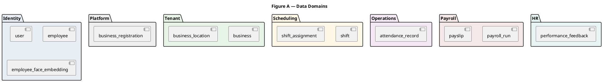
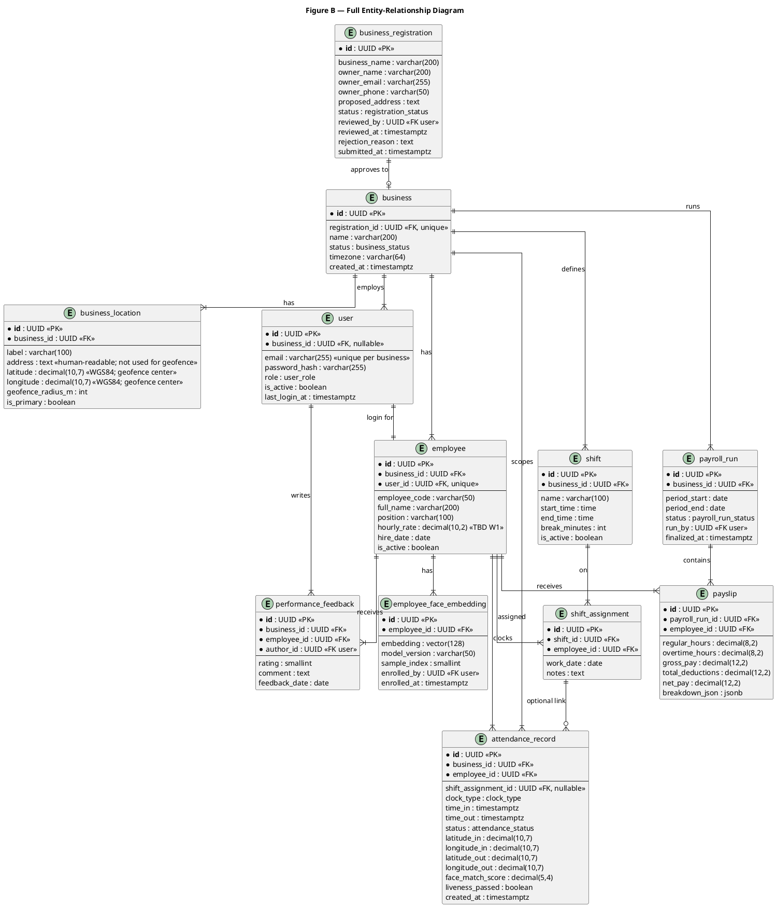
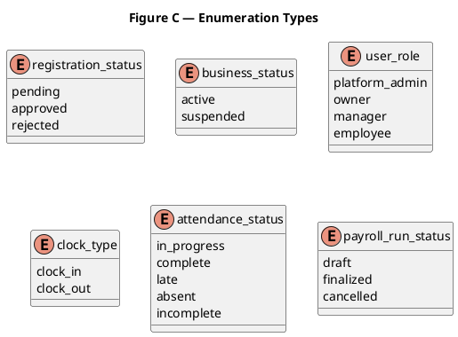

# Aroll+ Database ERD

**Related:** [SOLUTION.md](SOLUTION.md) (system design overview) · [SYSTEM-WORKFLOWS.md](SYSTEM-WORKFLOWS.md) (how the system works)

This document is the **detailed data model** for Aroll+. Use it for Chapter 3 (database design), W1 data-requirements work, and Alembic migrations in June.

---

## 1. Design principles

| Principle | Description |
|-----------|-------------|
| **Multi-tenant** | Every operational row belongs to a `business_id` (except platform-level registration). |
| **UUID primary keys** | All tables use `UUID` for `id` (generated server-side). |
| **Audit timestamps** | `created_at`, `updated_at` on mutable tables (omitted in diagrams for readability). |
| **Soft delete** | Employees use `is_active`; businesses use `status` instead of hard delete. |
| **Biometric separation** | Face vectors live in `employee_face_embedding`; never store raw images long-term in v1 (optional short-lived upload bucket — Ch. 4). |

---

## 2. Domain groups



---

## 3. Full entity-relationship diagram



---

## 4. Enumerations



| Enum | Values | Used in |
|------|--------|---------|
| `registration_status` | pending, approved, rejected | `business_registration.status` |
| `business_status` | active, suspended | `business.status` |
| `user_role` | platform_admin, owner, manager, employee | `user.role` |
| `clock_type` | clock_in, clock_out | API payload / audit (optional column) |
| `attendance_status` | in_progress, complete, late, absent, incomplete | `attendance_record.status` |
| `payroll_run_status` | draft, finalized, cancelled | `payroll_run.status` |

---

## 5. Entity dictionary

### 5.1 Platform

#### `business_registration`

| Column | Type | Notes |
|--------|------|-------|
| id | UUID PK | |
| business_name | varchar(200) | From signup form |
| owner_name | varchar(200) | |
| owner_email | varchar(255) | Becomes owner `user` on approval |
| owner_phone | varchar(50) | Optional |
| proposed_address | text | Free-text workplace address at signup; converted to `business_location.address` + lat/lng after approval |
| status | enum | pending → approved/rejected |
| reviewed_by | UUID FK → user | Platform admin only |
| reviewed_at | timestamptz | |
| rejection_reason | text | Required if rejected |
| submitted_at | timestamptz | Default now() |

#### `business`

| Column | Type | Notes |
|--------|------|-------|
| id | UUID PK | Tenant root |
| registration_id | UUID FK unique | Link to approved registration |
| name | varchar(200) | Display name |
| status | enum | active, suspended |
| timezone | varchar(64) | e.g. Asia/Manila |
| created_at | timestamptz | |

### 5.2 Location

Each worksite stores a **human-readable address** and **GPS coordinates** together. Attendance geofencing uses only `latitude`, `longitude`, and `geofence_radius_m`; `address` is for display and admin reference.

| Field role | Columns | Purpose |
|------------|---------|---------|
| Display | `label`, `address` | Branch name and formatted street address (maps, payslips, owner UI) |
| Geofence | `latitude`, `longitude`, `geofence_radius_m` | WGS84 center and radius (meters) for clock-in/out validation |

**Onboarding flow:** Registration collects `proposed_address` (text only). After approval, the owner sets the primary `business_location` by entering or confirming `address`, then pinning coordinates on a map (or geocoding the address to populate `latitude` / `longitude`). Both address and coordinates are required before the business can accept geofenced attendance.

#### `business_location`

| Column | Type | Notes |
|--------|------|-------|
| id | UUID PK | |
| business_id | UUID FK | |
| label | varchar(100) | e.g. Main branch |
| address | text | Human-readable workplace address (street, barangay, city, province). Shown in admin and mobile; **not** used for distance checks. |
| latitude | decimal(10,7) | WGS84 latitude of geofence center; paired with `longitude` for Haversine validation on clock-in/out |
| longitude | decimal(10,7) | WGS84 longitude of geofence center; set via map pin or geocode of `address` during setup |
| geofence_radius_m | int | Default TBD W1 (e.g. 100m) |
| is_primary | boolean | One primary per business for clock-in |

### 5.3 Identity

#### `user`

| Column | Type | Notes |
|--------|------|-------|
| id | UUID PK | |
| business_id | UUID FK nullable | NULL for platform_admin |
| email | varchar(255) | Unique per (business_id, email) |
| password_hash | varchar(255) | bcrypt/argon2 |
| role | enum | See user_role |
| is_active | boolean | |
| must_change_password | boolean | Default true for provisioned employees |
| last_login_at | timestamptz | |

#### `employee`

| Column | Type | Notes |
|--------|------|-------|
| id | UUID PK | |
| business_id | UUID FK | |
| user_id | UUID FK unique | One login per employee |
| employee_code | varchar(50) | Optional internal ID |
| full_name | varchar(200) | |
| position | varchar(100) | |
| hourly_rate | decimal(10,2) | **TBD W1** — may move to payroll_rule |
| hire_date | date | |
| is_active | boolean | |

#### `employee_face_embedding`

| Column | Type | Notes |
|--------|------|-------|
| id | UUID PK | |
| employee_id | UUID FK | |
| embedding | vector(128) | pgvector; dimension matches model |
| model_version | varchar(50) | e.g. face_rec_v1 |
| sample_index | smallint | 1..N enrollment samples |
| enrolled_by | UUID FK → user | Manager |
| enrolled_at | timestamptz | |

**Index:** `CREATE INDEX ON employee_face_embedding USING hnsw (embedding vector_cosine_ops);`

### 5.4 Scheduling

#### `shift`

| Column | Type | Notes |
|--------|------|-------|
| id | UUID PK | |
| business_id | UUID FK | |
| name | varchar(100) | Morning, Closing, etc. |
| start_time | time | Local business time |
| end_time | time | |
| break_minutes | int | Unpaid break |
| is_active | boolean | |

#### `shift_assignment`

| Column | Type | Notes |
|--------|------|-------|
| id | UUID PK | |
| shift_id | UUID FK | |
| employee_id | UUID FK | |
| work_date | date | |
| notes | text | Optional |

**Unique:** `(shift_id, employee_id, work_date)`

### 5.5 Attendance

#### `attendance_record`

| Column | Type | Notes |
|--------|------|-------|
| id | UUID PK | |
| business_id | UUID FK | Denormalized for tenant queries |
| employee_id | UUID FK | |
| shift_assignment_id | UUID FK nullable | Link expected shift |
| time_in | timestamptz | Set on clock-in |
| time_out | timestamptz | Set on clock-out |
| status | enum | Derived/updated by rules |
| latitude_in / longitude_in | decimal | Clock-in GPS |
| latitude_out / longitude_out | decimal | Clock-out GPS |
| face_match_score | decimal(5,4) | Best similarity at clock-in |
| liveness_passed | boolean | |
| created_at | timestamptz | |

### 5.6 Payroll

#### `payroll_run`

| Column | Type | Notes |
|--------|------|-------|
| id | UUID PK | |
| business_id | UUID FK | |
| period_start | date | |
| period_end | date | |
| status | enum | draft → finalized |
| run_by | UUID FK → user | Manager/owner |
| finalized_at | timestamptz | |

#### `payslip`

| Column | Type | Notes |
|--------|------|-------|
| id | UUID PK | |
| payroll_run_id | UUID FK | |
| employee_id | UUID FK | |
| regular_hours | decimal(8,2) | |
| overtime_hours | decimal(8,2) | |
| gross_pay | decimal(12,2) | |
| total_deductions | decimal(12,2) | |
| net_pay | decimal(12,2) | |
| breakdown_json | jsonb | Line items for display |

**Unique:** `(payroll_run_id, employee_id)`

### 5.7 HR

#### `performance_feedback`

| Column | Type | Notes |
|--------|------|-------|
| id | UUID PK | |
| business_id | UUID FK | |
| employee_id | UUID FK | |
| author_id | UUID FK → user | Manager/owner |
| rating | smallint | e.g. 1–5 |
| comment | text | |
| feedback_date | date | |

---

## 6. Relationship summary

| From | To | Cardinality | Description |
|------|-----|-------------|-------------|
| business_registration | business | 1 : 0..1 | Approval creates business |
| business | business_location | 1 : N | One or more worksites |
| business | user | 1 : N | All accounts except platform_admin |
| business | employee | 1 : N | Workforce |
| user | employee | 1 : 1 | Employee role has linked user |
| employee | employee_face_embedding | 1 : N | Multiple enrollment samples |
| business | shift | 1 : N | Shift templates |
| shift + employee | shift_assignment | N : M | Resolved via assignment table |
| employee | attendance_record | 1 : N | Daily clock events |
| business | payroll_run | 1 : N | Pay periods |
| payroll_run | payslip | 1 : N | One row per employee per run |
| employee | payslip | 1 : N | Historical payslips |
| employee | performance_feedback | 1 : N | Feedback over time |

---

## 7. Payroll configuration (W1 locked)

See [W1-DATA-REQUIREMENTS.md](W1-DATA-REQUIREMENTS.md) for defaults (₱1/min late, ₱1/min OT, 75 m geofence).

#### `position`

| Column | Type | Notes |
|--------|------|-------|
| id | UUID PK | |
| business_id | UUID FK | |
| title | varchar(100) | Cashier, Barista, etc. |
| daily_rate | decimal(10,2) | Pesos per day |
| is_active | boolean | |

#### `business_payroll_config`

| Column | Type | Notes |
|--------|------|-------|
| business_id | UUID PK FK | One row per business |
| pay_period_type | enum | weekly, semi_monthly, monthly |
| late_deduction_enabled | boolean | Default true |
| late_deduction_per_minute | decimal(10,2) | Default 1.00 |
| overtime_enabled | boolean | Default true |
| overtime_per_minute | decimal(10,2) | Default 1.00 |
| next_payday_date | date | Optional |

#### `employee` (additions)

| Column | Type | Notes |
|--------|------|-------|
| position_id | UUID FK nullable | Links to `position` |
| employment_type | varchar(50) | full_time, part_time |

Custom `deduction_type` / named rules: **Phase 2** (not MVP).

---

## 8. Referential integrity rules

1. **Cascade:** Deactivating `employee` sets `is_active = false`; do not delete rows with attendance history.
2. **Restrict:** Cannot delete `business` with any `attendance_record` or finalized `payroll_run`.
3. **Platform admin:** `user.business_id` IS NULL and `role = platform_admin`.
4. **Tenant scope:** All API queries filter by JWT `business_id` except platform admin registration endpoints.

---

## 9. Sample SQL (pgvector)

```sql
CREATE EXTENSION IF NOT EXISTS vector;

CREATE TABLE employee_face_embedding (
  id UUID PRIMARY KEY DEFAULT gen_random_uuid(),
  employee_id UUID NOT NULL REFERENCES employee(id),
  embedding vector(128) NOT NULL,
  model_version VARCHAR(50) NOT NULL,
  sample_index SMALLINT NOT NULL,
  enrolled_by UUID NOT NULL REFERENCES "user"(id),
  enrolled_at TIMESTAMPTZ NOT NULL DEFAULT now()
);

CREATE INDEX idx_efe_embedding ON employee_face_embedding
  USING hnsw (embedding vector_cosine_ops);
```

---

## 10. Migration 004 — owner setup extensions

Added in Alembic revision `004` for the owner setup wizard.

| Table / column | Purpose |
|----------------|---------|
| `business.setup_completed_at` | Timestamp when owner completes guided setup (`NULL` until finished). |
| `shift.shift_type` | Enum: `morning`, `afternoon`, `evening`, `night`. |
| `shift.employee_capacity` | Max employees assignable to the shift (default `1`). |
| `business_attendance_policy` | Per-business attendance rules (PK = `business_id`): grace periods, overtime, missing clock-out policy. |
| `business_rest_day_policy` | Per-business weekly rest day and premium settings (PK = `business_id`). |
| `holiday` | Business or platform holidays: date, paid flag, type, multiplier. |

Setup wizard step completion for attendance, rest day, and holidays requires an **explicit save** (PUT/create) — GET endpoints return defaults without inserting policy rows.

---

## Document history

| Version | Date | Notes |
|---------|------|-------|
| 1.0 | May 2026 | Initial detailed ERD for thesis / W1 |
