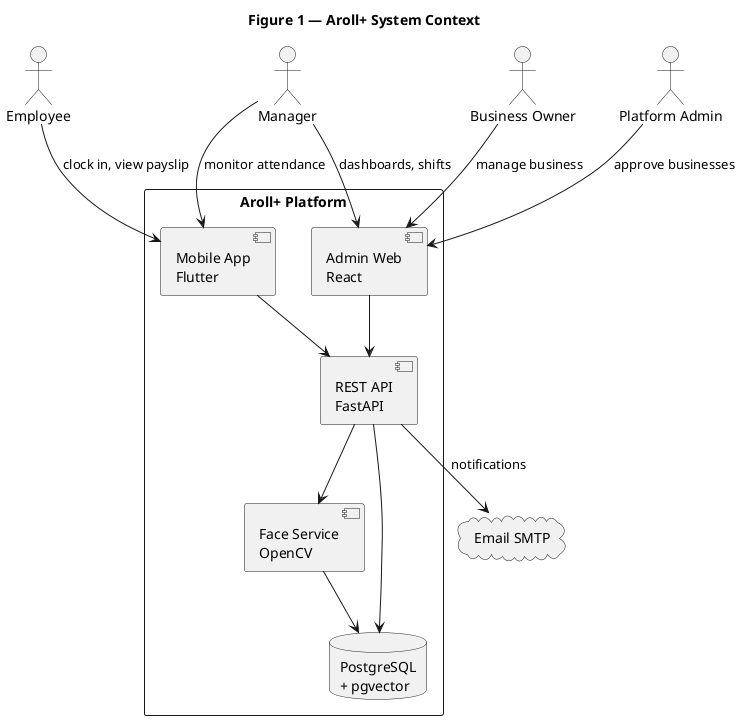
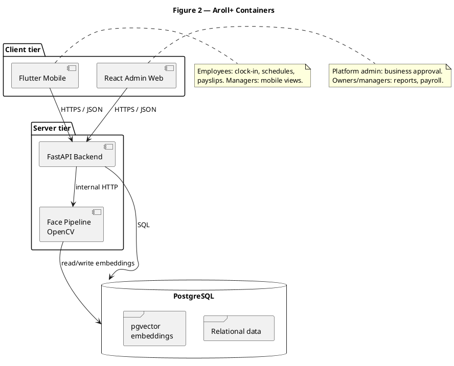
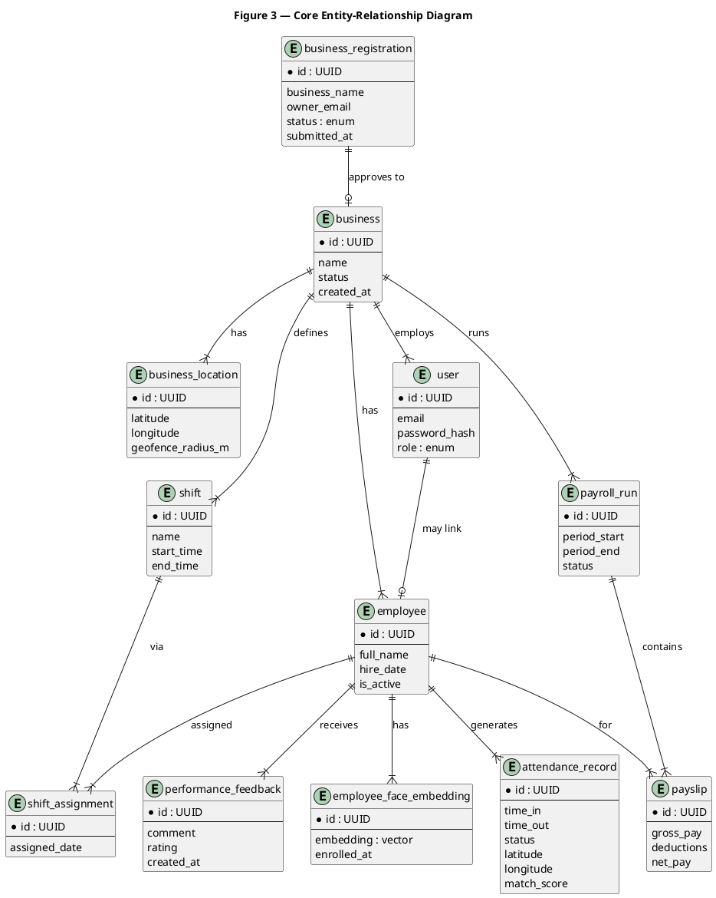
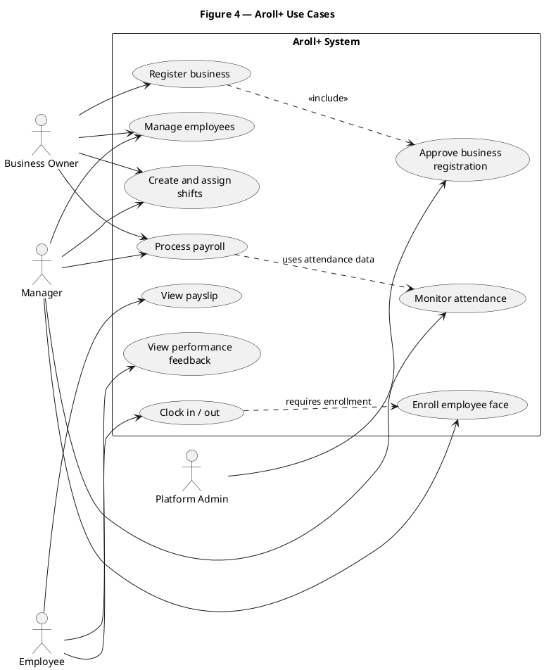
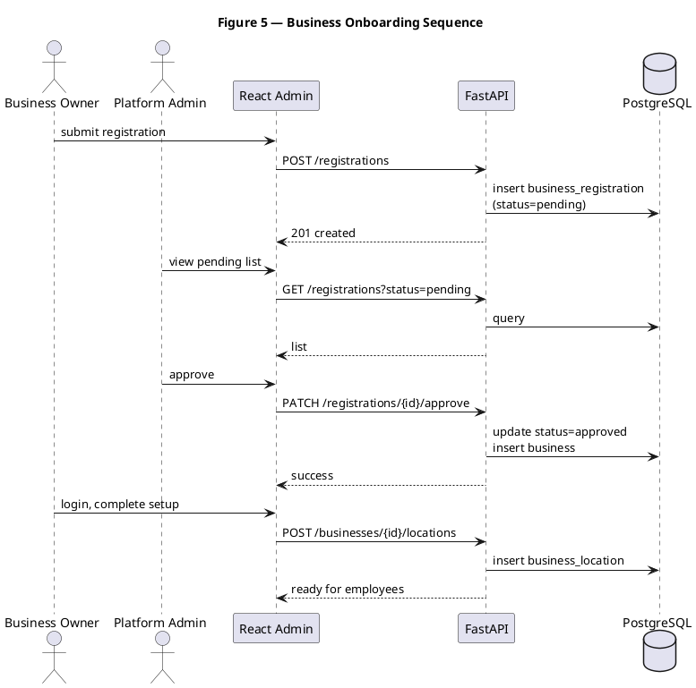
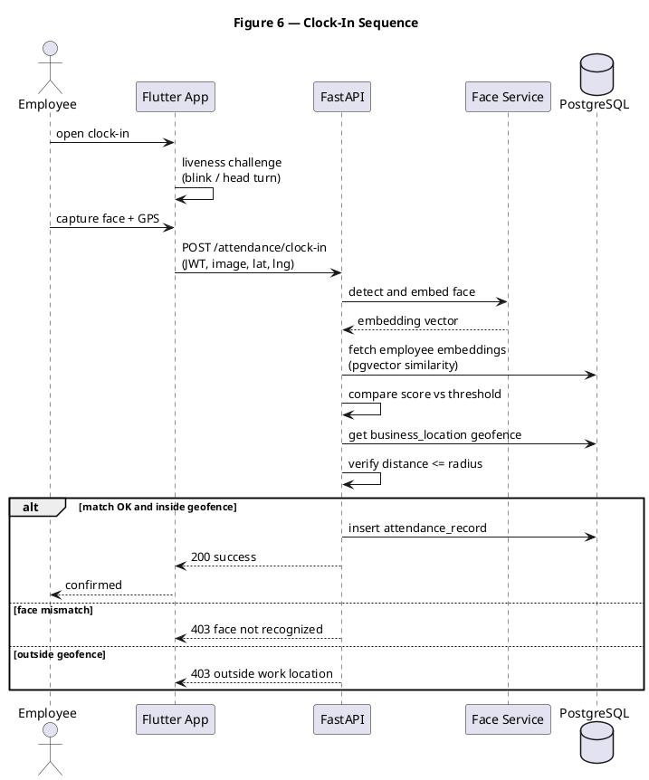

# Aroll+ System Design Document

**Project:** Aroll+: Face Recognition-Based Attendance and Payroll System  
**Document type:** System design (thesis Chapter 3 source)  
**Version:** 1.0 (draft)  
**Date:** May 2026  
**Scope:** Standard thesis documentation (Option B)

**Related documents:**

- [DATABASE-ERD.md](DATABASE-ERD.md) — detailed ERD, entity dictionary, enums, SQL
- [SYSTEM-WORKFLOWS.md](SYSTEM-WORKFLOWS.md) — how the system works (activity, sequence, state diagrams)

---

## 1. Introduction

### 1.1 Purpose

**Aroll+** is an online, mobile-first system that records employee work time using **facial recognition** and feeds that data into a **payroll module** so salaries can be computed automatically. It targets small food-and-beverage and service businesses that still rely on manual logbooks, spreadsheets, messaging apps, or slow fingerprint scanners for attendance and payroll.

### 1.2 Pilot businesses

The system is designed and evaluated in the context of four local businesses:

| Business | Context |
|----------|---------|
| Mr. Bean Cafe | Cafe |
| Ugom Cafe | Cafe |
| Pande Doc | Service |
| Benzon Burger House | Quick-service restaurant |

Interviews with these businesses confirmed manual attendance tracking, manual payroll computation, lack of fixed shift/overtime policies, and no integrated digital attendance–payroll platform.

### 1.3 Institutional alignment

- **UN SDG 8** (Decent Work and Economic Growth) — Targets 8.3 and 8.5: productive employment, fair pay, and improved access to financial/workforce tools.
- **Bicol University Thematic Area 2** — Industry, Energy, and Emerging Technology: technology-assisted business operations.

### 1.4 Study objectives

This design supports the three objectives stated in Chapter 1:

1. **Determine data requirements** for system development (entities, roles, attendance and payroll data — detailed in Section 6 and W1 data-requirements work).
2. **Design a mobile application** that centralizes attendance tracking and payroll processing using facial recognition.
3. **Evaluate** the system on **ISO/IEC 25010** characteristics: **Functional Suitability** and **Reliability** (evaluation design in Chapter 5; brief note in Section 10).

### 1.5 Proposed solution (summary)

Aroll+ allows stakeholders to:

1. **Clock attendance** via contactless facial recognition, with **liveness detection** and **geolocation** to confirm identity and on-site presence.
2. **Monitor work time** in near real time through dashboards.
3. **Compute payroll automatically** from captured work hours, including shifts, overtime, and deductions (business-specific rules to be finalized in W1).

---

## 2. Scope

### 2.1 In scope

| Area | Description |
|------|-------------|
| Business onboarding | Registration request → platform admin approval → owner adds business |
| Workforce management | Employee records, shift creation and assignment |
| Attendance | Face enrollment, clock-in/out with liveness and geofence |
| Monitoring | Attendance and time views for owners and managers |
| Payroll | Automated computation from attendance; digital payslips |
| Employee self-service | View schedules, attendance, payslips, performance feedback (read-only) |
| Notifications | Email summaries of attendance and payroll records |
| Quality evaluation | ISO 25010 — Functional Suitability and Reliability |

### 2.2 Out of scope

- Inventory management
- Point-of-sale (POS) or customer purchase tracking
- QR code or pincode as primary clock-in method (see Section 10 — manuscript alignment)

### 2.3 Limitations and assumptions

- **Internet connectivity** is required at clock-in; the system does not support offline attendance sync in v1 (per Chapter 1 Scope and Limitations).
- **Facial recognition accuracy** depends on lighting, camera quality, and enrollment quality; failures may block attendance marking.
- **Timely data entry** by managers (shifts, employee records) is required for correct payroll.
- Payroll rates, overtime formulas, and deduction rules are **TBD** until W1 data-requirements sessions with pilot businesses.

---

## 3. Users and roles

### 3.1 Role definitions

| Role | Description |
|------|-------------|
| **Platform administrator** | Operates the admin web app; reviews, approves, or rejects business registration requests. |
| **Business owner** | Registers a business; after approval, manages employees, attendance, payroll, shifts, and performance reports. |
| **Manager** | Adds employees, creates and assigns shifts, monitors attendance, processes payroll via dashboards. |
| **Employee** | Clocks attendance via mobile app; views schedules, attendance history, payslips, and performance feedback only. |

### 3.2 Permission matrix (RBAC)

| Capability | Platform admin | Owner | Manager | Employee |
|------------|:--------------:|:-----:|:-------:|:--------:|
| Approve/reject business registration | Yes | — | — | — |
| Manage business profile | — | Yes | — | — |
| CRUD employees | — | Yes | Yes | — |
| Create/assign shifts | — | Yes | Yes | — |
| Enroll employee face | — | Yes | Yes | — |
| Clock in/out (face) | — | — | — | Yes |
| View all attendance (business) | — | Yes | Yes | — |
| View own attendance | — | — | — | Yes |
| Run/process payroll | — | Yes | Yes | — |
| View payslips (own) | — | — | — | Yes |
| View performance feedback (own) | — | — | — | Yes |
| Edit attendance/payroll records | — | Yes | Yes* | No |

\*Manager manual attendance override (if any) is **TBD in W1**; default design is employee self clock-in only.

### 3.3 Authentication model

- **Login:** Username/email + password; API issues **JWT** with role and `business_id` claims.
- **Clock-in verification:** Face + liveness + geolocation **after** login; face match confirms the logged-in employee is the person at the device.

---

## 4. System architecture

### 4.1 Architectural style

Aroll+ uses a **three-tier, API-centric** architecture:

- **Presentation:** Flutter (mobile) and React (admin web)
- **Application:** FastAPI REST API (business logic, auth, orchestration)
- **Data:** PostgreSQL with **pgvector** for face embeddings
- **Specialized processing:** OpenCV-based face service (detect, align, embed, compare)

All clients communicate with the backend over HTTPS. The face service may run as a separate container or module invoked by FastAPI.

### 4.2 System context diagram



### 4.3 Container diagram



### 4.4 Tenancy and data isolation

Each **business** is a tenant. Employee, attendance, shift, and payroll records include a `business_id` foreign key. Platform administrators can access cross-tenant registration queues only; operational data is scoped by business.

### 4.5 Deployment (summary)

Development uses **Docker Compose** (PostgreSQL + pgvector, API, optional face-service). Production deployment (staging for UAT, then pilot) is documented in **Chapter 4** — options include a single VPS or managed PaaS (Railway, Render, etc.).

---

## 5. Technology stack

| Layer | Technology | Responsibility |
|-------|------------|----------------|
| Mobile app | **Flutter** | Employee clock-in, schedules, payslips; manager mobile views |
| Admin web | **React** | Business approval, dashboards, attendance and payroll reports |
| API | **FastAPI** (Python) | REST endpoints, JWT auth, payroll logic, face-service calls |
| Face pipeline | **OpenCV** (+ embedding model e.g. face_recognition / ONNX) | Detect face, generate vector, support liveness preprocessing |
| Database | **PostgreSQL 15+** with **pgvector** | Relational data; cosine similarity on face embeddings |
| Email | SMTP (e.g. Gmail, SendGrid) | Payslip and attendance notification emails |
| Dev environment | Docker Compose | Local database and services for development |

---

## 6. Database design

### 6.1 Core entities

| Entity | Purpose |
|--------|---------|
| `business_registration` | Pending/approved/rejected signup requests |
| `business` | Approved tenant (name, status, settings) |
| `business_location` | Worksite coordinates and geofence radius (meters) |
| `user` | Login account (email, password hash, role) |
| `employee` | Workforce member linked to `user` and `business` |
| `employee_face_embedding` | Face vector(s) per employee (pgvector column) |
| `shift` | Shift template (start/end, labels) |
| `shift_assignment` | Employee assigned to shift for a date range |
| `attendance_record` | time_in, time_out, status, GPS, match_score |
| `payroll_run` | Payroll batch for a period |
| `payslip` | Computed pay line items per employee per run |
| `performance_feedback` | Manager-to-employee feedback (employee read-only) |

**TBD (W1):** `payroll_rule`, `overtime_rule`, `deduction_type` — exact schema after interviews with pilot businesses.

### 6.2 Entity-relationship diagram



### 6.3 Key design notes

- **Face embeddings:** Stored in `employee_face_embedding.embedding` using pgvector; index for similarity search (e.g. IVFFlat or HNSW).
- **Attendance status:** e.g. `present`, `late`, `absent`, `incomplete` — derived from shift times and clock events.
- **Payroll:** `payslip` rows are immutable after a `payroll_run` is finalized.

---

## 7. Use cases

### 7.1 Use case diagram



### 7.2 Use case summaries

| ID | Use case | Primary actor | Brief description |
|----|----------|---------------|-----------------|
| UC1 | Approve business registration | Platform admin | Review and approve/reject signup requests. |
| UC2 | Register business | Business owner | Submit registration; after approval, complete business profile. |
| UC3 | Manage employees | Owner, manager | Add, update, deactivate employee records. |
| UC4 | Create and assign shifts | Owner, manager | Define shifts and assign to employees by date. |
| UC5 | Enroll employee face | Manager | Capture face samples; store embeddings in database. |
| UC6 | Clock in / out | Employee | Face + liveness + GPS validation; create attendance record. |
| UC7 | Monitor attendance | Owner, manager | View real-time or daily attendance lists and reports. |
| UC8 | Process payroll | Owner, manager | Run payroll for a period; generate payslips. |
| UC9 | View payslip | Employee | Read-only access to own payslips. |
| UC10 | View performance feedback | Employee | Read-only access to feedback from management. |

---

## 8. Key processes

### 8.1 Business onboarding



**Narrative:** The owner submits a registration request. The platform admin approves or rejects it. On approval, a `business` record is created. The owner configures the worksite location (for geofencing) and may add managers and employees.

### 8.2 Clock-in (face + liveness + geolocation)



**Narrative:** The employee must be logged in. The app runs a liveness check, captures a face image and GPS coordinates, and sends them to the API. The face service produces an embedding compared against enrolled vectors for that business. If similarity exceeds the configured threshold and the user is within the geofence, an attendance record is created.

### 8.3 Payroll processing

```plantuml
@startuml Payroll_Sequence
title Figure 7 — Payroll Run Sequence

actor Manager
participant "React Admin" as Web
participant "FastAPI" as API
database "PostgreSQL" as DB
cloud "Email SMTP" as Email

Manager -> Web : start payroll run
Web -> API : POST /payroll/runs\n(period_start, period_end)
API -> DB : fetch attendance_records\n+ shift_assignments
API -> API : apply payroll rules\n(TBD W1)
API -> DB : insert payroll_run, payslips
API --> Web : run complete

Manager -> Web : finalize run
Web -> API : POST /payroll/runs/{id}/finalize
API -> DB : lock payslips
API -> Email : send payslip emails
API --> Web : done

@enduml
```

**Narrative:** The manager selects a pay period. The API aggregates attendance and shift data, applies business-specific rules (hourly rate, overtime, deductions — **TBD W1**), and creates payslip records. After finalization, employees can view payslips in the mobile app and optional email notifications are sent.

---

## 9. Face recognition and payroll overview

### 9.1 Face recognition

| Phase | Steps |
|-------|--------|
| **Enrollment** | Manager captures multiple face images per employee → face service detects and crops face → generates embedding → stored in `employee_face_embedding`. |
| **Verification (clock-in)** | Live capture → liveness gate → embedding → pgvector similarity search within the employee’s business → accept if score ≥ threshold. |
| **Liveness** | Lightweight challenge on device (e.g. blink or head turn) or frame-variance check before API call. |
| **Geolocation** | Haversine distance from `business_location` center; reject if outside `geofence_radius_m`. |

**Design parameters (to tune during July build):**

- Minimum enrollment samples: e.g. 3–5 images
- Similarity metric: cosine distance via pgvector
- Threshold: configurable per environment (e.g. 0.6–0.75 cosine similarity)

### 9.2 Payroll

| Input | Output |
|-------|--------|
| `attendance_record` (time_in, time_out) | Regular hours per day |
| `shift_assignment` + `shift` | Expected hours, late/absent flags |
| Rules **TBD W1** | Overtime hours, deductions, gross/net pay |
| `payroll_run` | Batch of `payslip` rows per employee |

Payroll formulas (hourly rate, overtime multiplier, government deductions, pay period cadence) will be documented in the **W1 data-requirements** deliverable and implemented in August (per project timeline).

---

## 10. Manuscript alignment and thesis chapters

### 10.1 Chapter 1 manuscript fix

Chapter 1 **Scope** and **Introduction** describe **facial recognition + liveness + geolocation**. The **Significance of the Study (Employees)** section incorrectly mentions **QR scanning and pincode authentication**.

**Action before defense:** Update the Significance section to describe face-based clock-in (consistent with the implemented system). Implementation and this document use **face recognition only** for attendance verification.

### 10.2 Mapping to thesis chapters

| Thesis chapter | Content source |
|----------------|----------------|
| **Chapter 1** | Problem, objectives, scope (existing PDF) |
| **Chapter 2** | Related literature (QR, face, mobile attendance, payroll automation) |
| **Chapter 3** | **This document** — architecture, ERD, use cases, sequences, stack |
| **Chapter 4** | Implementation: repo structure, APIs, screenshots, deployment setup |
| **Chapter 5** | ISO 25010 evaluation (Functional Suitability, Reliability), UAT with four businesses |

### 10.3 ISO/IEC 25010 (preview for Chapter 5)

Evaluation will focus on:

- **Functional Suitability** — Do features (onboarding, face clock-in, payroll, payslips) meet stated requirements?
- **Reliability** — Stability under normal use, error handling when face/geo/network fails.

Detailed test cases and results are **not** in this document; they belong in Chapter 5.

---

## Appendix A — Recommended repository layout

When implementation starts (June W2):

```
aroll/
  backend/           # FastAPI + Alembic
  face-service/      # OpenCV embedding API (or module in backend)
  mobile/            # Flutter
  admin-web/         # React
  docs/
    SOLUTION.md      # this file
  docker-compose.yml
```

---

## Appendix B — Document history

| Version | Date | Changes |
|---------|------|---------|
| 1.0 | May 2026 | Initial system design (Option B) for thesis Ch. 3 |

---

*End of document*
