# Aroll+ System Workflows

**Related:** [SOLUTION.md](SOLUTION.md) · [DATABASE-ERD.md](DATABASE-ERD.md)

This document explains **how Aroll+ works** end-to-end using PlantUML diagrams. Use it alongside Chapter 3 for process descriptions and demo narration.

---

## 1. How the system works (overview)

At a high level, Aroll+ connects four user types to one shared backend. Employees prove identity with **face + liveness + GPS**; managers and owners run the business on **web dashboards**; a platform admin onboards new tenants.

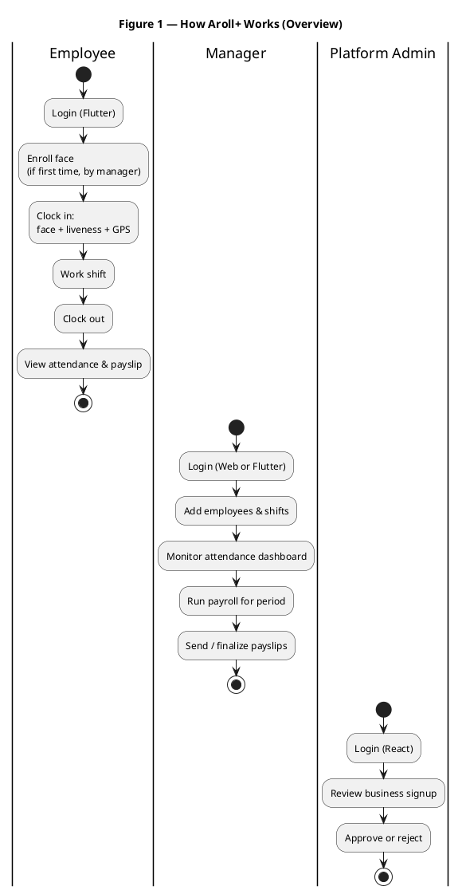

---

## 2. System layers and request flow

Every action flows **client → FastAPI → database** (and **face service** when biometrics are involved).

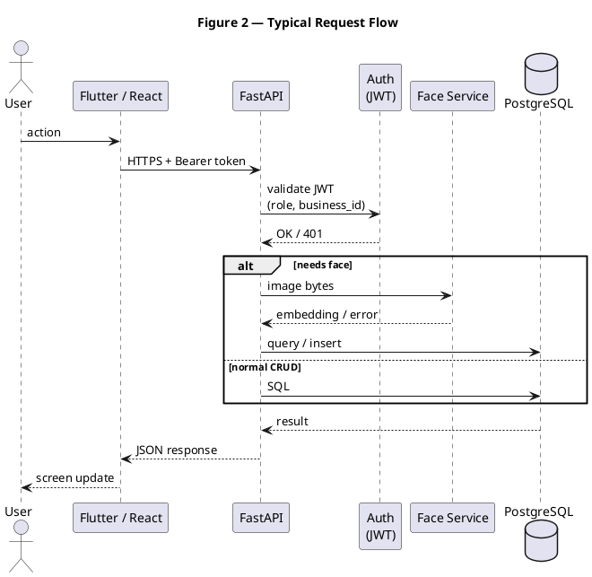

---

## 3. Business lifecycle

From signup to active tenant.

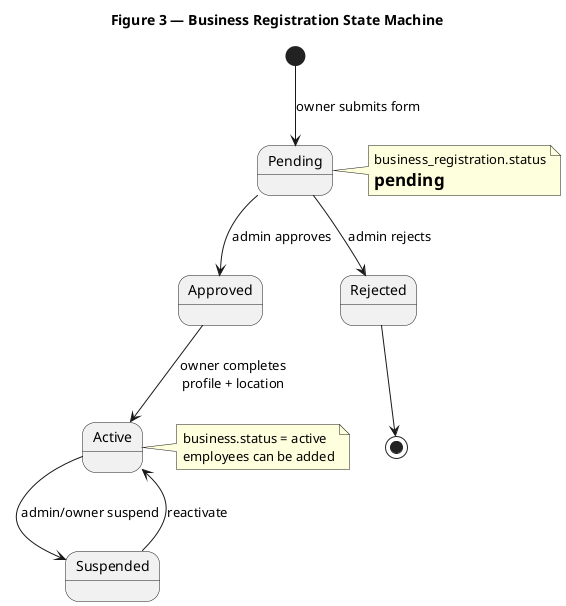

**Steps in plain language:**

1. Owner fills registration on web → `pending`.
2. Platform admin approves → `business` row created → owner invited to set password.
3. Owner adds **business_location** (`address` + `latitude`/`longitude` + geofence radius) → business is **active**.
4. Manager enrolls employees and assigns shifts.

---

## 4. Employee journey (end-to-end)

```plantuml
@startuml Employee_Journey
title Figure 4 — Employee Journey

|#LightBlue|Employee|#LightBlue|
start
:Receive email + temp password\nfrom owner/manager;
:First login\n(Flutter);
:Forced change password\n(must_change_password);
if (Face enrolled?) then (no)
  :Face enrollment\n(deferred — last build block);
  note right: Interim: view schedule/payslip only
else (yes)
endif
:Open Clock In;
:Liveness challenge;
:Capture face + GPS;
if (Verified?) then (yes)
  :Attendance recorded;
else (no)
  :Show error\n(retry or contact manager);
  stop
endif
:Work until shift end;
:Clock Out\n(face + GPS again);
:View attendance history;
:View payslip\n(after payroll run);
stop

@enduml
```

---

## 5. Face enrollment workflow

Managers enroll employees **before** they can clock in.

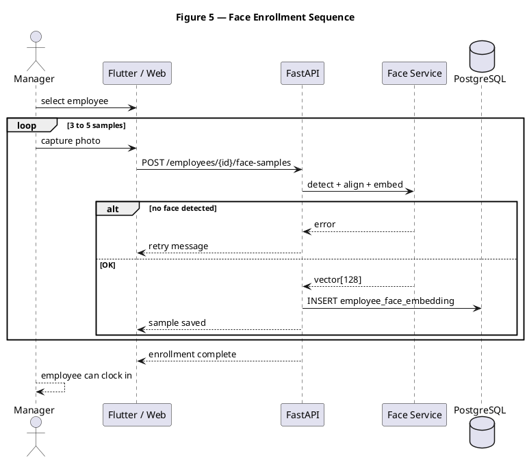

---

## 6. Clock-in / clock-out workflow

Core attendance path (matches thesis scope: face + liveness + geolocation).

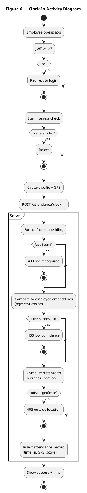

### Attendance record state

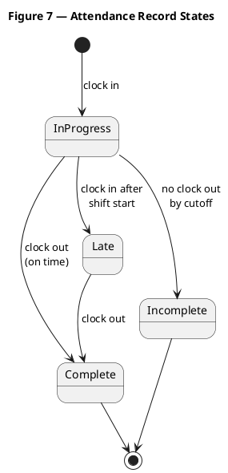

---

## 7. Shift and scheduling workflow

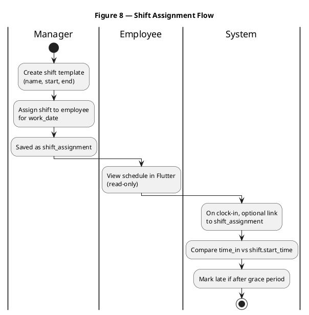

---

## 8. Payroll workflow

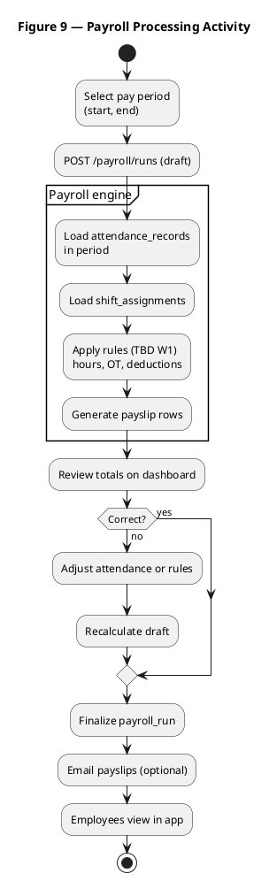

### Payroll run state

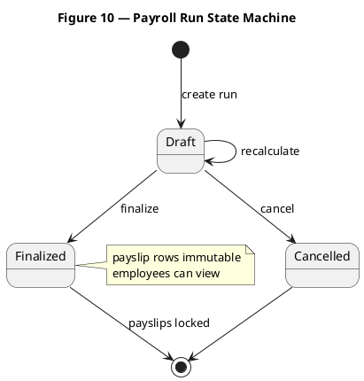

---

## 9. Role-based access flow

```plantuml
@startuml RBAC_Flow
title Figure 11 — Login and Role Routing

actor User
participant "Client App" as Client
participant "FastAPI" as API
database "PostgreSQL" as DB

User -> Client : email + password
Client -> API : POST /auth/login
API -> DB : find user + verify hash
API --> Client : JWT (role, business_id)

alt platform_admin
  Client --> User : React admin\n(registrations)
elseif owner or manager
  Client --> User : React dashboards\n+ optional Flutter
elseif employee
  Client --> User : Flutter\n(clock-in, payslip)
end

@enduml
```

---

## 10. End-to-end data flow (attendance → payroll)

How time captured at clock-in becomes pay on a payslip.

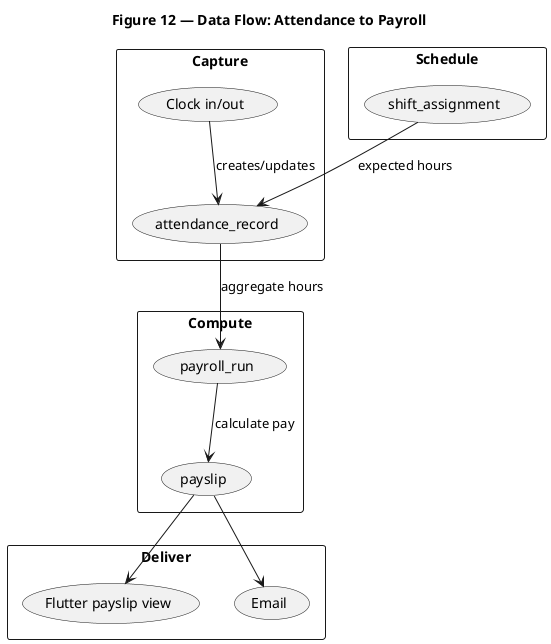

---

## 11. Error handling (reliability preview)

How the system behaves when something fails (supports ISO 25010 Reliability discussion in Ch. 5).


| Failure                   | System response       | User message                   |
| ------------------------- | --------------------- | ------------------------------ |
| No network                | Request fails         | Check internet connection      |
| Face not detected         | 400 from face service | Center face in frame           |
| Face not recognized       | 403                   | Identity not verified          |
| Outside geofence          | 403                   | You must be at the workplace   |
| Liveness failed           | 403                   | Please try liveness again      |
| No enrollment             | 403                   | Contact manager for face setup |
| Payroll already finalized | 409                   | Period already closed          |


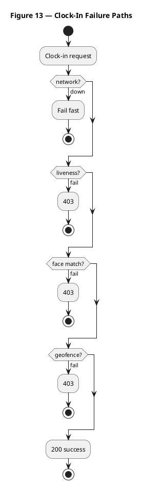

---

## 12. Diagram index


| Figure | File section | Diagram type                |
| ------ | ------------ | --------------------------- |
| 1      | §1           | Activity — overview         |
| 2      | §2           | Sequence — request flow     |
| 3      | §3           | State — business lifecycle  |
| 4      | §4           | Activity — employee journey |
| 5      | §5           | Sequence — face enrollment  |
| 6      | §6           | Activity — clock-in         |
| 7      | §6           | State — attendance          |
| 8      | §7           | Activity — shifts           |
| 9      | §8           | Activity — payroll          |
| 10     | §8           | State — payroll run         |
| 11     | §9           | Sequence — login/RBAC       |
| 12     | §10          | Component — data flow       |
| 13     | §11          | Activity — errors           |


---

## 13. Rendering PlantUML

1. Install **PlantUML** extension in Cursor/VS Code.
2. Open this file and preview diagrams, or export PNG/SVG for thesis figures.
3. Online: paste a `@startuml` block into [https://www.plantuml.com/plantuml](https://www.plantuml.com/plantuml).

---

## Document history


| Version | Date     | Notes                     |
| ------- | -------- | ------------------------- |
| 1.0     | May 2026 | Initial workflow document |


